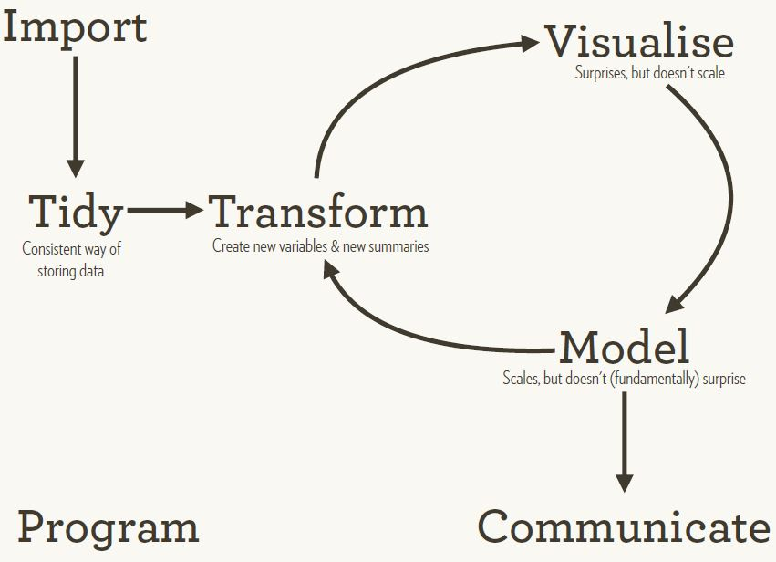
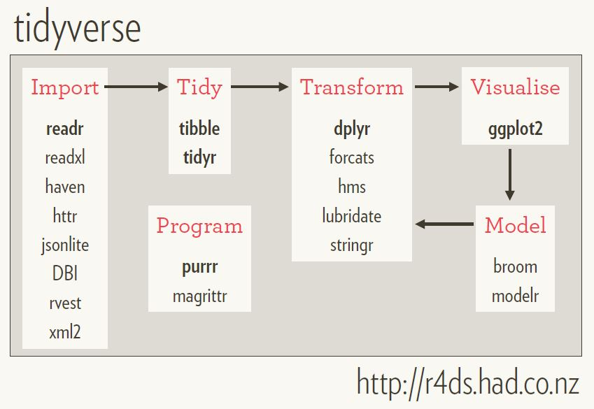

```{r, include=FALSE}
knitr::opts_chunk$set(warning = FALSE, error = FALSE, message = FALSE)
```

## Tidy Data
  
|       
|   **Tidy data sets are all the same.**
|   **Each messy data set is messy in its own way.**  
|                                                           -- Hadley Wickham

| | |
|:------------------------------------------|----------------:|
|R used to be a cryptic tool built by statisticians for statisticians until [Hadley Wickham](http://hadley.nz/) came into the scene and made it cool! [despite being a statistician ;) ] He [introduced](https://www.jstatsoft.org/index.php/jss/article/view/v059i10/v59i10.pdf) the pholosophy of tidy data and viewing data analysis as a deeply interconnected and iterative process. He has also created or inspired the creation of multiple R packages. | {width=120px}|  
  
<br/>

#### **What Kind of Data is Tidy?**

* Each variable you measure should be in one column
* Each different observation of that variable should be in a different row
* There should be one table for each "kind" of variable
* If you have multiple tables, they should include a column in the table that allows them to be joined or merged

|    (source: https://github.com/jtleek/datasharing)
|      
|        

#### **Data Science Process using Tidy Data**

Tidy data becomes a component in the whole process of data analysis.  

<br/>
{width=600px}

|     (Source: R4DS book)

---

## Tidyverse

Tidyverse is a set of R packages that are compatible with tidy data principles and covers the entire data science process described above. These could be thought of as "tidy tools".


{width=400px} 

<br/>
{width=650px}

|   (source: http://www.storybench.org/getting-started-with-tidyverse-in-r/)


---

## Wrangling Urban Agglomorations

This is an example using the urban agglomorations (Class-1 cities) population data from the Census of India 2011. We look at the population growth in these cities and the changes in sex ratio over the decades.

We will specify the whole data cleaning and transformation process as a `dplyr` pipeline. Before you start, do read the dplyr documentation by issuing the commands `help(dplyr)` and `vignette("dplyr")` at the console in RStudio. Also refer to the RStudio [cheat sheets](https://www.rstudio.com/resources/cheatsheets/).  


```{r}
library(readxl)
library(zoo)
library(tidyverse)

data <- read_excel("data/CLASS I.xlsx", 
                   skip = 53,
                   col_names = c('ua_no', 'ua', 'district', 'year', 'type', 'area', 
                                 'population', 'pop_change', 'pop_change_percent', 
                                 'pop_male', 'pop_female'))

```


```{r}
data <- data %>% 
  filter(!(!is.na(ua) & is.na(district) & is.na(year) & is.na(population))) %>% 
  filter(!(!is.na(ua_no) & is.na(as.integer(ua_no)))) %>% 
  mutate(
    rowselector = ifelse(!is.na(ua_no),
                         TRUE, 
                         ifelse(is.na(year), FALSE, NA))
  ) %>% 
  mutate(rowselector = zoo::na.locf(rowselector)) %>% 
  filter(rowselector == TRUE) %>% 
  mutate(
    ua_no = zoo::na.locf(ua_no),
    ua = zoo::na.locf(ua),
    year = as.integer(gsub("[^0-9]", "", year)),
    area = as.double(area),
    population = as.integer(population),
    pop_change = as.integer(pop_change),
    pop_change_percent = as.double(pop_change_percent),
    pop_male = as.integer(pop_male),
    pop_female = as.integer(pop_female)
  ) %>%
  filter(year >= 1961) %>% 
  select(-c(rowselector, district, type))
```
<br/>
One would ideally do some more careful processing of the NA's, but for now, we just ignore it and proceed.

#### Sex ratio change

```{r}
sex_ratio_change <- data %>% 
  mutate(sex_ratio = pop_male/pop_female) %>% 
  group_by(ua_no) %>% 
  do(lm = lm(sex_ratio ~ year, data = .)) %>% 
  mutate(sex_ratio_slope = summary(lm)$coeff[2]) %>%
  select(ua_no, sex_ratio_slope)

data %>% 
  inner_join(sex_ratio_change, by = "ua_no") %>% 
  arrange(desc(sex_ratio_slope)) %>% 
  mutate(sex_ratio = pop_male / pop_female) %>% 
  select(ua, year, sex_ratio_slope, population, sex_ratio)
```

#### Population Change

**Practice:** Do a similar analysis on population growth. Are there countries that did not have much growth in populaton over the years?

```{r}
## Your code here

```

#### Total Population in Class-1 Cities in Each Census

This is in fact already part of the excel sheet. Just to demostrate dplyr verbs.

```{r}
data %>% 
  group_by(year) %>% 
  summarise(
    total_area = sum(area, na.rm = TRUE),
    total_population = sum(population, na.rm = TRUE),
    total_female = sum(pop_female, na.rm = TRUE),
    total_male = sum(pop_male, na.rm = TRUE)
  ) %>% 
  mutate(sex_ratio = round(total_male/total_female, 2))
```


Spread and gather: long to wide and vice versa. 

```{r}
pop_years <- data %>% 
  select(ua, year, population) %>% 
  spread(year, population) 

print(pop_years)

cor(pop_years$`2011`, pop_years$`1961`, use = "pairwise.complete.obs")
```

**Practice**: if we don't want numerical column names in the wide data (above), we could add a prefix (e.g. `year_`) to the year values. Create a data frame with such a modification. Hint: `paste()` or `glue()`  

```{r}
## Your code here
```

Write the data to disk

```{r}
write_csv(data, "data/ua_populations.csv")
write_csv(sex_ratio_change, "data/sex_ratio_change.csv")
```

---

## References

* Arguably the best book to bootstrap into the world of tidyverse. Co-authored by Hadley Wickham: [{width=200px}](http://r4ds.had.co.nz/)

* This great talk by Hadley Wickham covers the background of what kind of problems Tidyverse is trying to solve: https://www.youtube.com/watch?v=K-ss_ag2k9E. The slides are available [here](https://slides.nyhackr.org/presentations/The-Tidyverse_Hadley-Wickham.pdf)


* https://www.rstudio.com/resources/cheatsheets/

* https://style.tidyverse.org/

* [The tidyverse manifesto](https://cran.r-project.org/web/packages/tidyverse/vignettes/manifesto.html)

* [The split-apply-combine strategy for data
analysis](https://citeseerx.ist.psu.edu/viewdoc/download?doi=10.1.1.182.5667&rep=rep1&type=pdf)


